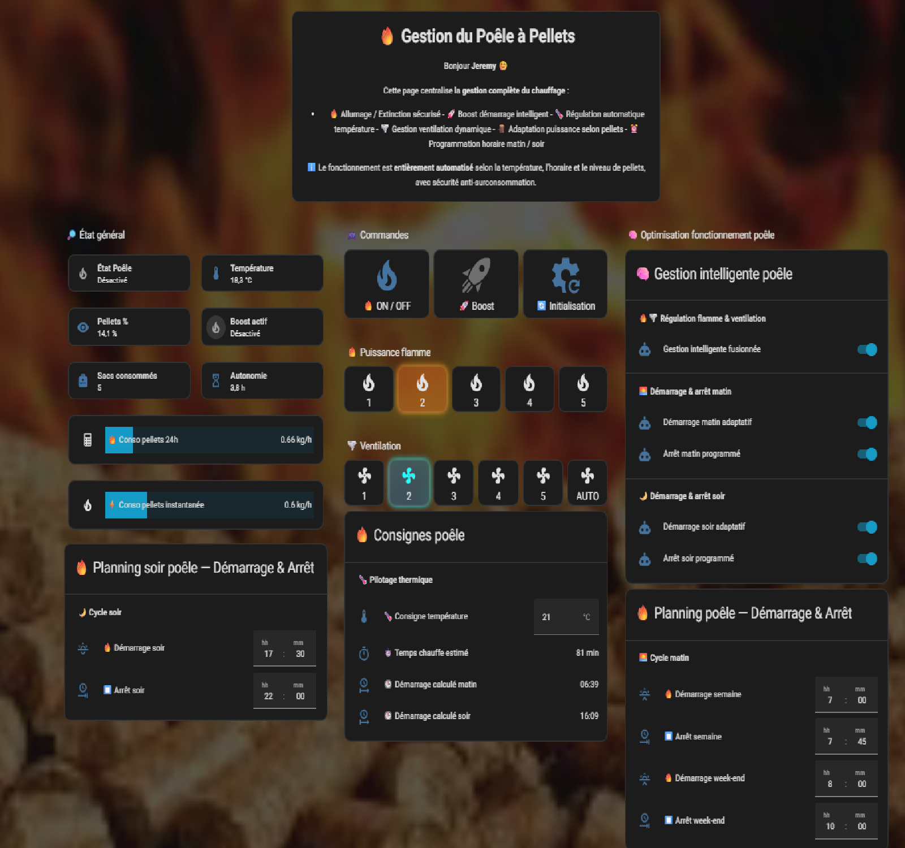
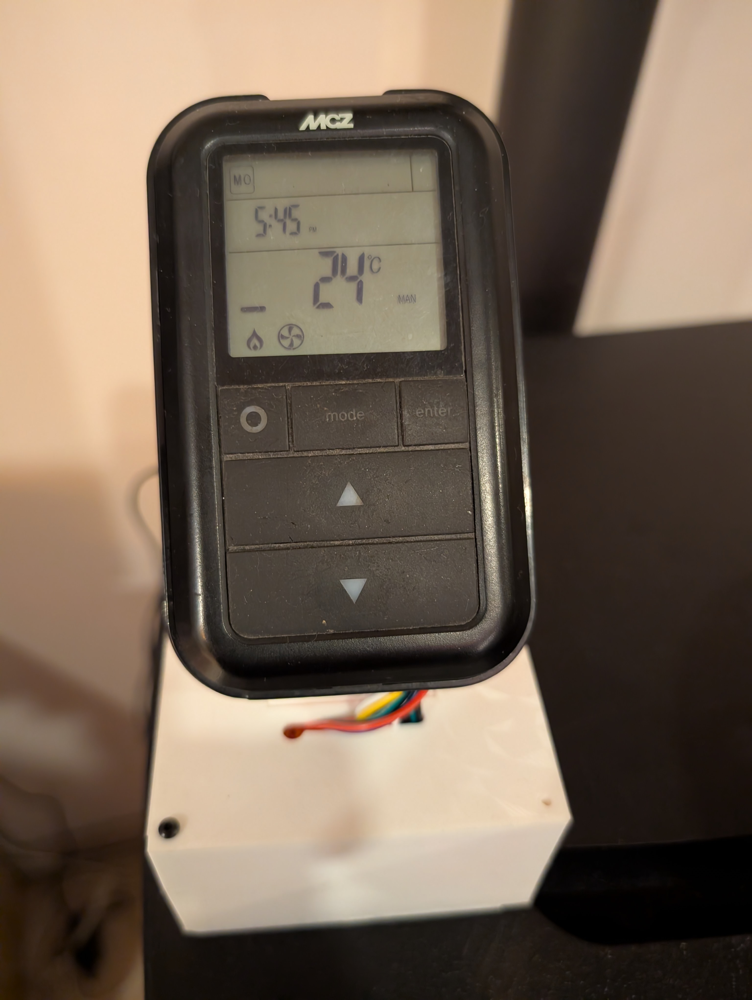
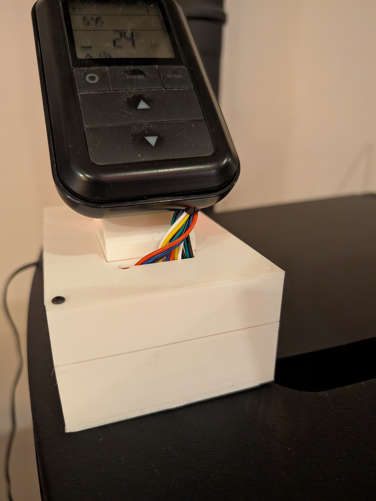
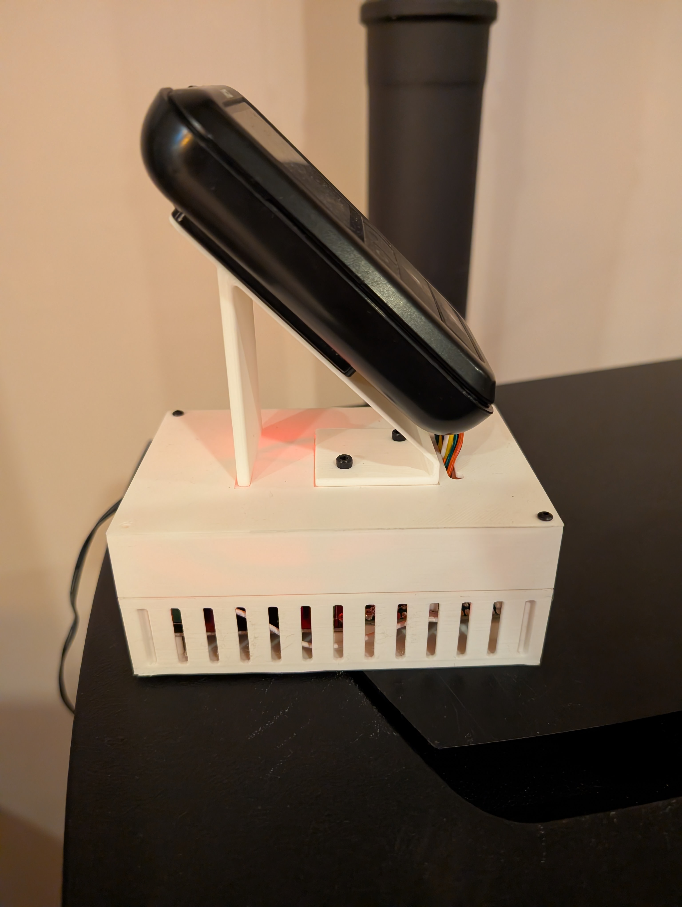

# 🪵 MCZ EGO 2.0 — Smart Control via Home Assistant

Système complet de pilotage intelligent pour poêle à pellets **MCZ EGO 2.0** basé sur **Home Assistant**, utilisant l’émulation de télécommande RF pour automatiser la gestion thermique, la ventilation, la sécurité et la consommation.

---

## 🎯 Objectif du projet

Rendre un poêle **MCZ EGO 2.0 non connecté** entièrement domotisable grâce à Home Assistant :

- 🔁 Pilotage RF automatisé  
- 🌡️ Gestion thermique adaptative  
- ⏱️ Anticipation des démarrages  
- 🪵 Sécurité niveau pellets  
- 📦 Détection remplissage  
- 📊 Calcul d’autonomie  
- 🖥️ Dashboard temps réel  

---

## 🔧 Installation matérielle

**Configuration utilisée :**

| Équipement | Modèle / Méthode |
|------------|------------------|
| Poêle | MCZ EGO 2.0 |
| Télécommande | RF d’origine |
| Contrôle | Pont RF / IR émulé |
| Température salon | Capteur Tuya Wi-Fi |
| Niveau pellets | VL53L0X — ESPHome |
| Hôte domotique | Home Assistant sur Proxmox |
| Supervision | Dashboard Lovelace personnalisé |

---

## 🧠 Fonctionnalités

### 🔥 Gestion thermique intelligente

- Démarrage adaptatif matin  
- Démarrage adaptatif soir  
- Différenciation semaine / week-end  
- Anticipation selon température réelle  
- Mode Boost automatique  

---

### 🌪️ Gestion flamme + ventilation fusionnée

- Pilotage synchronisé flamme / ventilation  
- Adaptation selon écart température cible  
- Limitation nocturne automatique  
- Séquences RF temporisées  
- Verrou anti-collision commandes  

---

### 🪵 Gestion pellets

- Blocage démarrage si niveau **< 10 %**  
- Calcul autonomie restante  
- Calcul consommation **kg/h**  
- Moyenne glissante 24 h  

---

### 📦 Détection remplissage

- Détection ajout sac pellets  
- Anti faux-positifs (bras / entonnoir)  
- Anti-spam temporel  
- Incrément compteur sacs consommés  

---

### 🛡️ Sécurités intégrées

- Fallback si capteur température indisponible  
- Verrou commandes RF  
- Anti-yoyo température (hystérésis)  
- Anti redémarrage multiple  
- Sécurité pellets bas  

---

## 📊 Dashboard inclus

Affichages disponibles :

- 🌡️ Température salon  
- 🎯 Température cible  
- ⏱️ Temps de chauffe estimé  
- 🕒 Heure démarrage calculée  
- 🪵 Niveau pellets  
- 📦 Sacs consommés  
- 🔥 État poêle  
- 🚀 Boost actif  
- ⌛ Autonomie restante  

---

## 🛠 Automatisations incluses

- Démarrage matin FULL adaptatif  
- Démarrage soir FULL adaptatif  
- Arrêt programmé matin  
- Arrêt programmé soir  
- Gestion flamme intelligente  
- Gestion ventilation intelligente  
- Fusion flamme + ventilation  
- Détection remplissage pellets  
- Sécurité niveau pellets  

---

## 📂 Structure du dépôt

automations/ → Logiques du poêle
scripts/ → Commandes RF / IR
helpers/ → Inputs / mémoires / verrous
sensors/ → Capteurs calculés
dashboard/ → Interface Lovelace
docs/ → Documentation technique

---

## 🚀 Installation

1. Copier les fichiers YAML dans Home Assistant  
2. Créer les helpers nécessaires  
3. Importer les automatisations  
4. Adapter les `entity_id`  
5. Lier les scripts RF à votre pont RF / IR  

---

## ⚠️ Avertissement

Projet **non affilié à MCZ**.

Utilisation à vos risques :

- Mauvaise configuration = risque de surchauffe  
- Toujours conserver les sécurités d’origine du poêle

---

## 🖥️ Interface Home Assistant

---

## 🖨️ Intégration & boîtier 3D

### Montage final

---

## 📜 Licence

Licence **MIT** — libre d’utilisation et de modification.

---

## 🤝 Contribution

Projet personnel évolutif.

Les améliorations, retours d’expérience et idées sont les bienvenus.
