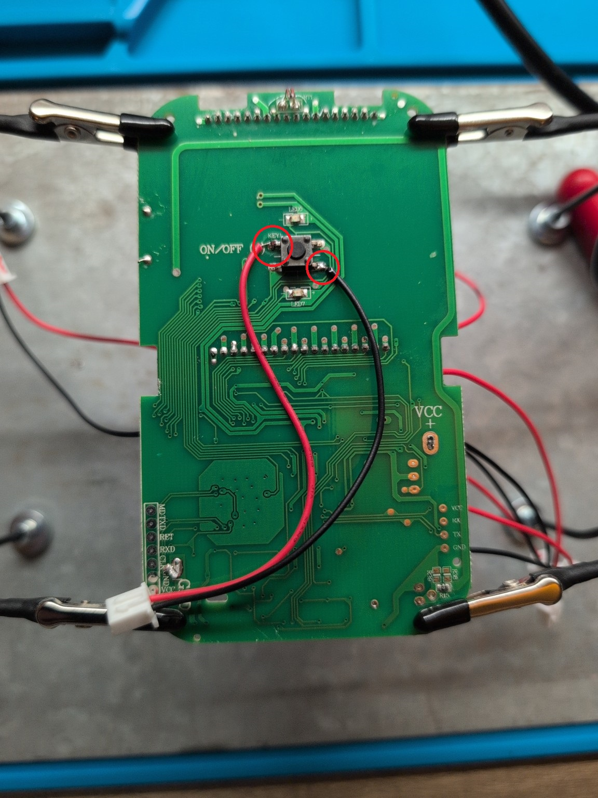

# 🔌 Fonctionnement des optocoupleurs

## 📖 Principe général

Les optocoupleurs permettent de **simuler l’appui sur les boutons physiques de la télécommande** sans aucun contact électrique direct entre l’ESP32 et l’électronique d’origine.

Ils assurent :

- 🔒 Isolation électrique complète  
- 🛡️ Protection de la télécommande  
- ⚡ Aucune injection de tension externe  
- 📡 Aucune perturbation RF  

---

## ⚙️ Comment ça fonctionne

Un optocoupleur contient deux parties :

1️⃣ **Une LED interne** (côté ESP32)  
2️⃣ **Un phototransistor** (côté télécommande)

Quand l’ESP active une sortie GPIO :

1. La LED interne s’allume  
2. Le phototransistor se ferme  
3. Les deux pistes du bouton sont court-circuitées  
4. La télécommande détecte un appui  

👉 Cela simule exactement une pression sur le bouton.

---

## 🔍 Schéma de principe

CÔTÉ ESP32
GPIO ── Résistance ──► LED optocoupleur ◄── GND

CÔTÉ TÉLÉCOMMANDE
Phototransistor
│
├── Piste bouton 1
└── Piste bouton 2

⚠️ Il n’y a **aucun lien électrique** entre les deux circuits.

---

## 🖲️ Simulation d’un appui bouton

Oui — le principe est bien :

➡️ Court-circuiter les deux contacts du bouton.

Mais :

❌ Pas directement avec un fil  
❌ Pas avec un relais mécanique  
✅ Via le transistor isolé de l’optocoupleur  

---

## 📸 Exemple réel — Repiquage ON/OFF

Ajouter ici vos photos annotées :

---

Fil rouge → piste 1 du bouton
Fil noir → piste 2 du bouton
Reliés au transistor de l’optocoupleur

🔒 Pourquoi ne pas relier directement l’ESP ?

Parce que :

La télécommande possède sa propre alimentation

Les masses ne sont pas communes

Risque de destruction du PCB

Parasites électroniques possibles

👉 L’optocoupleur agit comme un interrupteur optique isolé.

🧩 Correspondance boutons / GPIO
Bouton	GPIO ESP32
ON/OFF	GPIO14
SET	GPIO32
MODE	GPIO33
ENTER	GPIO25
UP	GPIO26
DOWN	GPIO27

(Adapter selon votre configuration YAML)

⚡ Résistances de limitation

Chaque LED d’optocoupleur doit avoir une résistance :

Valeur recommandée : 220 à 330 Ω

Protège la LED interne

Évite la surconsommation GPIO

🛠️ Modèles compatibles

Exemples d’optocoupleurs utilisables :

PC817

EL817

LTV-817

TLP281

Modules 1 à 8 canaux compatibles.

🧠 Vulgarisation simple

Les optocoupleurs agissent comme des “doigts électroniques” qui appuient sur les boutons de la télécommande sans contact électrique direct.
