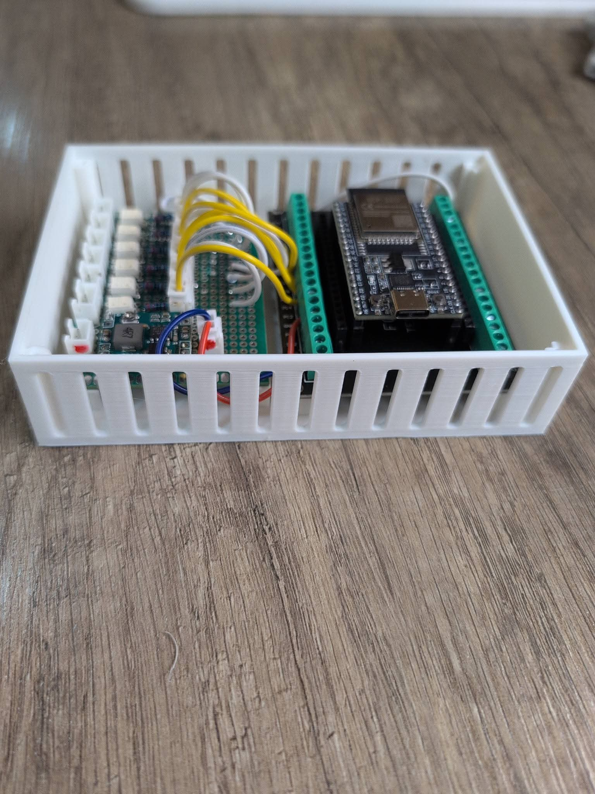
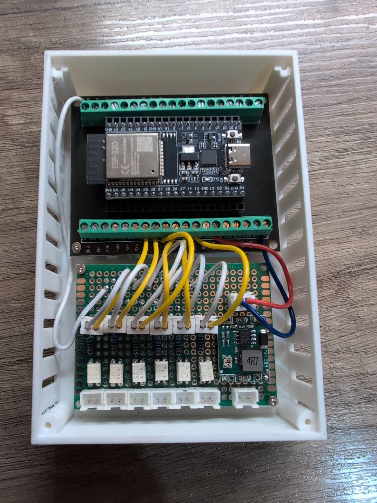
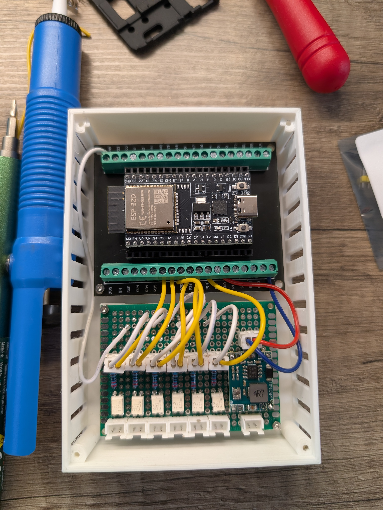
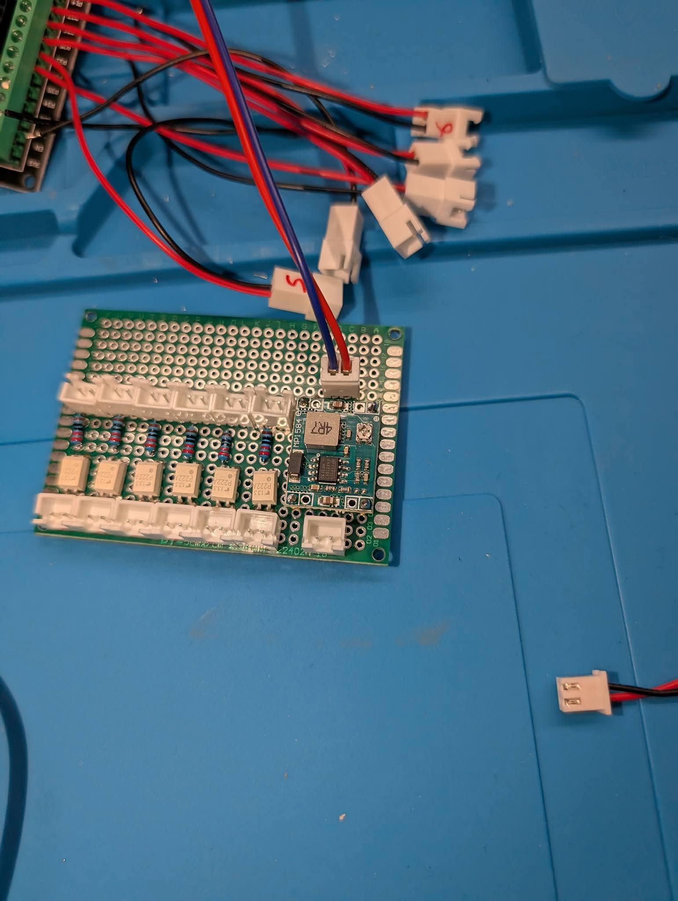

## 🔌 Schéma électronique — Interface télécommande RF

Le pilotage du poêle **MCZ EGO 2.0** repose sur l’émulation complète de la télécommande RF d’origine via un microcontrôleur **ESP32** et des optocoupleurs assurant l’isolation électrique.

---

### 🧠 Principe de fonctionnement

Chaque bouton de la télécommande est reproduit électroniquement :

ESP32 → Optocoupleur → Contact bouton télécommande

Cette architecture permet :

- Une isolation galvanique totale
- Aucun retour de tension vers l’ESP32
- Aucune modification du circuit RF d’origine
- Un fonctionnement identique à un appui physique

---

### 🎛️ Boutons émulés

| Fonction | GPIO ESP32 |
|---------|-------------|
| ON / OFF | GPIO14 |
| SET | GPIO32 |
| MODE | GPIO33 |
| ENTER | GPIO25 |
| HAUT | GPIO26 |
| BAS | GPIO27 |

---

### 🔧 Interface de commande

Chaque ligne GPIO pilote :

- Une LED d’optocoupleur
- Résistance série 330 Ω
- Transistor opto câblé en contact sec

---

### ⚡ Alimentation

- Module step-down 5V dédié
- Alimentation ESP32 via EXT_5V
- Masse commune uniquement côté ESP32
- Isolation conservée côté télécommande

---

## 🖼️ Schéma Fusion 360

> Schéma réalisé sous Fusion Electronics.

---

## 🔧 Carte de commande

### Assemblage

### Détail optocoupleurs

---

### 📌 Notes d’intégration

- Vérifier le sens collecteur / émetteur des optocoupleurs
- Ne pas relier la masse télécommande à l’ESP32
- Ajouter condensateurs de filtrage sur le step-down
- Utiliser des GPIO non critiques au boot (déjà respecté ici)

---

### 🚀 Évolutions possibles

- Ajout LED statut commandes
- Watchdog hardware ESP32
- Passage PhotoMOS / relais statiques
- PCB dédié compact

---
